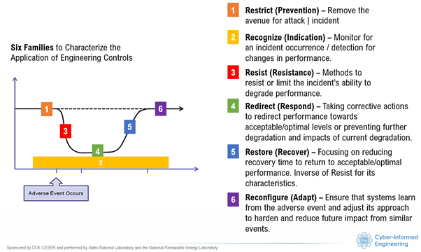

# Cyber-Informed Engineering (CIE) – Engineered Controls Database and Use

## Scope and Intent  
Cyber-Informed Engineering (CIE) addresses the reality that cyber attacks on engineered systems can have consequences far beyond data loss or disruption of digital networks. When control systems are compromised, safety, reliability, and performance of the physical process itself may be threatened. This database is meant to establish clear examples and guidance for defining and applying engineered controls in CIE. It explains what engineered controls are, how they differ from information security measures, and how they are integrated into system design.  

The goal is to ensure that resilience is engineered into systems from the outset. Unlike cybersecurity protections that defend the digital layer, engineered controls act directly at the physical and algorithmic levels to guarantee that unacceptable consequences are prevented or limited. CIE keeps the consequences of a cyber attack from impacting the safety, reliability, and performance of engineered systems.

---

## Files
**CIE_EngCtrls_Slides.pptx** – Slides describing the concept of engineered controls and this research product.

**Engineered_controls.pdf** – Writeup describing this product and the concept of engineered controls.

**Engctrls-full_csv.zip** – Engineering controls database in comma-delimited format

**Engctrls-full_json.zip** – Engineering controls database in JSON format

---

## Definition of Engineered Controls  
Engineered controls are **design features embedded in engineered systems that remove avenues of cyber attack or limit the consequences of such attacks**. They function as resilient-by-design mechanisms, ensuring that even if digital protections fail, the system remains safe, reliable, and capable of recovery.  

These controls are fundamentally different from information security tools such as firewalls, intrusion detection systems, encryption, or patching. Those tools protect data, access, and networks. Engineered controls, by contrast, protect the **engineered process itself**. They represent the point where engineering practice intersects with cyber resilience, and they are evaluated not for confidentiality, integrity, or availability of information, but for their ability to safeguard **safety, reliability, and performance**.  

---

## Categories of Engineered Controls  
Engineered controls fall into several distinct categories, each rooted in physical or algorithmic design principles.  

**Physical logic mechanisms** are devices like hardwired relays, governors, interlocks, and relief valves that enforce decisions independent of digital software. They are among the strongest protections, since they operate outside the reach of cyber manipulation.  

**Redundant designs** provide multiple protective paths, often combining physical and digital domains. A common example is the pairing of thermal and magnetic elements in a breaker trip, ensuring that failure of one pathway does not eliminate protection. Cross-domain redundancy, where different physical principles coexist, strengthens resilience by design.  

**Physical constraints and material properties** rely on inherent physical characteristics to enforce safe operation. A fusible plug that melts at a fixed temperature, or a bimetallic switch that opens under thermal expansion, will act regardless of digital commands.  

**Digital engineered controls** are algorithmic mechanisms deliberately designed to function under adversarial or untrustworthy inputs. These include resilient estimators, anomaly-tolerant observers, or adaptive controllers that maintain stability when digital data is compromised.  

**Passive physical dynamics** harness natural system physics to buffer disturbances. Flywheels that smooth torque or hydraulic accumulators that absorb pressure surges are examples of controls that slow degradation without active intervention.  

**One-way enforcement and irreversible actions** include mechanisms such as ratchets, clutches, or data diodes. By their very design, they eliminate entire classes of cyber attack by making reversal or backflow impossible.  

**Fail-safe defaults**, often described as de-energize-to-safe designs, ensure that loss of control or power automatically drives the system into a safe state. Spring-return valves that close when unpowered and motor contactors that drop out without energy are typical examples.  

Together, these categories create a portfolio of resilience options. Each one contributes differently to the phases of the resilience curve.  

---

## The Resilience Curve  
The resilience curve is a conceptual tool for understanding how systems experience disruption and return to stability. It describes three phases: the degradation phase, when the system begins to fail under disturbance; the recovery phase, when stabilization and control are regained; and the return to operation, when the system either resumes its original state or adapts into a hardened form.  

Engineered controls map to six functions along this curve. Some controls focus on restricting the impact opportunity (i.e, **prevention**), stopping degradation outright. Others provide slope control (i.e., **resistance**), slowing the rate of failure and enabling graceful degradation. Redirection (i.e., **respond**) mechanisms steer systems toward recovery rather than collapse. Restore speed (i.e., **recover**) functions accelerate and stabilize the return to safe operation. Reconfigure (i.e., **adapt**) mechanisms ensure that systems learn from disruption and harden against future events. Finally, recognizing through detection and monitoring (i.e., **indication**) enhance awareness of how the system is moving along the curve, giving operators and automation visibility into both degradation and recovery.  


---

## Mapping of Control Types to Resilience Functions  
Not every control type contributes equally to every resilience function. Physical logic mechanisms, one-way devices, and material constraints dominate prevention because they can physically block attack avenues. Passive dynamics and redundancy play their greatest role in slope control, buffering and slowing down failure. Fail-safe defaults, redundancy, and resilient algorithms are especially powerful in redirection, as they pivot system dynamics toward safe or recoverable states.  

Recovery speed is most strongly supported by fail-safe defaults and physical logic, which allow systems to snap back into safe states automatically. Adaptation is almost entirely the domain of digital engineered controls, which adjust algorithms and decision strategies based on lessons learned from disruption. Finally, detection and monitoring are driven largely by digital observers and estimators, though physical indicators such as gauges or trip flags can complement digital methods.

### Engineered Controls Mapped to Resilience Functions and System Objectives  

| Engineered Control Type          | Primary Resilience Functions Supported                 | Contribution to Safety | Contribution to Reliability | Contribution to Performance |
|---------------------------------|---------------------------------------------------------|------------------------|-----------------------------|-----------------------------|
| Physical Logic Mechanisms       | Prevention, Redirection, Recovery Speed                 | Strong – block unsafe actions | Strong – enforce stable fallback | Moderate – ensure stable operation |
| Redundant Designs               | Slope Control, Redirection                              | Strong – backup paths maintain safety | Strong – ensure continuity | Moderate – maintains service under failure |
| Physical Constraints/Materials  | Prevention                                              | Strong – enforce physical safety limits | Moderate – limit fault spread | Weak – may degrade performance under stress |
| Digital Engineered Controls     | Adaptation, Detection/Monitoring, Redirection           | Moderate – algorithmic fallback | Strong – compensate for data loss | Strong – optimize performance and adaptation |
| Passive Physical Dynamics       | Slope Control                                           | Moderate – reduce hazard escalation | Strong – buy time for operators | Moderate – smooths fluctuations |
| One-Way Enforcement Mechanisms  | Prevention, Redirection                                 | Strong – eliminate attack avenues | Moderate – force safe state | Weak – limited effect on efficiency |
| Fail-Safe Defaults              | Recovery Speed, Redirection                             | Strong – auto-return to safe state | Strong – rapid reconstitution | Moderate – reduces downtime |

---

## Four-Step Implementation Procedure for Engineered Controls  

The process of applying engineered controls follows four structured steps. Each step is accompanied by guiding questions that ensure thorough coverage.  

### Step 1. Identify Critical Functions  
- What system operations must maintain **safety, reliability, and performance** even under cyber attack?  
- What unacceptable consequences must be prevented?  

This step defines the essential functions of the system and establishes the consequence boundaries that engineered controls must enforce.  

### Step 2. Map to Resilience Curve Functions  
For each critical function, evaluate whether controls exist for all resilience roles:  

- **Prevention (Stop Impact Outright):**  
  Are there physical logic or one-way enforcement mechanisms that eliminate the attack avenue?  
  If no, at least one preventive control must be added.  

- **Slope Control (Graceful Failure):**  
  Are there passive dynamics, redundant paths, or constraints that slow degradation?  
  If no, buffering or redundancy must be designed in.  

- **Redirection (Toward Recovery):**  
  Are there fail-safe defaults, trip mechanisms, or resilient algorithms that pivot the system toward stability?  
  If no, explicit redirection mechanisms must be added.  

- **Recovery Speed (Rapid Reconstitution):**  
  Are there designs that quickly restore safe conditions after disruption, such as de-energize-to-safe defaults?  
  If no, fast-resetting mechanisms must be introduced.  

- **Adaptation (Future Hardening):**  
  Are digital resilient control practices in place to adjust to similar future events?  
  If no, adaptive algorithms must be included.  

- **Detection and Monitoring (Curve Awareness):**  
  Are monitoring mechanisms present to reveal slope, redirection, and recovery progress?  
  If no, sensors, indicators, or estimators must be added.  

### Step 3. Balance Across Control Types  
- Are **physical-first mechanisms** in place so that prevention and recovery do not depend on digital logic?  
- Are **digital-enhanced functions** used for adaptation and monitoring, but with physical observability wherever possible?  
- Is there **redundancy and diversity**, ensuring that physical and digital controls overlap and provide complementary coverage?  

Balancing ensures that no single control type dominates to the detriment of others.  

### Step 4. Validate Against Consequence Boundaries  
- Does the combined portfolio of engineered controls guarantee that consequences cannot cross safety, reliability, or performance thresholds?  
- If any gap remains, has the design been iterated until every resilience function is covered?  

This step confirms that engineered controls achieve their intended outcome: reducing overall risk and impact to the system’s core objectives.  

---

## Gap Analysis  
Experience shows several recurring gaps. Prevention is often well covered by physical mechanisms, but adaptation is frequently neglected, since it relies on deliberate inclusion of digital resilient controls. Passive dynamics and one-way devices provide good buffering but weak recovery speed, leaving systems slow to reconstitute unless paired with fail-safe defaults. Detection is another frequent weakness: physical controls often operate silently unless instrumented with sensors, leaving operators blind to system state. Finally, reliance on digital pathways for monitoring and adaptation can be dangerous if those same channels are compromised; hybrid physical indicators are often overlooked.  

---

## Strategic Principle  
Engineered controls are the essential foundation of resilience. They are not interchangeable with cybersecurity tools, nor should they be mistaken for them. Where cybersecurity measures aim for secure-by-design outcomes in digital networks, engineered controls ensure resilient-by-design outcomes in physical systems.  

CIE requires both, but it is engineered controls that ultimately guarantee that cyber attacks cannot compromise safety, reliability, or performance. Safety is bounded through prevention, slope control, and fail-safe defaults. Reliability is upheld by redundancy, redirection, and buffering. Performance is preserved through monitoring and adaptation. Taken together, these mechanisms ensure that engineered systems can withstand disruption, recover quickly, and emerge stronger.  

---

# JSON Output Reference

The remaining elements of this document defines every key in the JSON object contained in the EngCtrls json dataset.

---

## Top-level object

| Key | Type | Purpose | Constraints / Allowed Values | Example |
|---|---|---|---|---|
| `id` | `string` (UUIDv4) | Unique identifier for **this** response object. Generated client-side; not the same as the source item’s ID. | Must be a valid UUID (v4 recommended). | `"7f8f7b35-9db1-4f3e-9a2a-2c3f6d8a9e50"` |
| `input_id` | `number` or `string` | Foreign key linking the response to the originating input record from `idf.min.json` (`ID`). | Should equal the source object’s `ID`. | `1` |
| `scope_level` | `string` | The granularity of the analysis. | One of: `"Sector"`, `"Subsector"`, `"Segment"`, `"Subsegment"`, `"Asset"`. | `"Sector"` |
| `title` | `string` | Human-readable name being analyzed (from `Name`). | Non-empty. | `"Agriculture and Food"` |
| `brief_context` | `string` | One-sentence synthesis of `Description` to anchor the analysis. | Keep concise; 1–2 sentences max. | `"Covers growing crops, raising animals, and food processing for distribution."` |
| `critical_functions` | `string[]` | The essential functions to protect; controls should map to these. | 1+ items recommended; free-text labels. | `["Maintain safe pressure", "Ensure safe shutdown", "Prevent contamination"]` |
| `engineered_controls` | `object` | Container for the two control lists. | See nested fields below. | `{ "known_in_use": [...], "ideas_opportunities": [...] }` |

---

## `engineered_controls.known_in_use[]` (controls that are already applied in practice)

An array of **existing** engineered controls, preferably common within the specified scope.

| Key | Type | Purpose | Constraints / Allowed Values | Example |
|---|---|---|---|---|
| `critical_function` | `string` | Which function this control supports. | Should match or relate to an entry in `critical_functions`. | `"Maintain safe pressure"` |
| `category` | `string` | Classify the control by engineering nature. | One of: `"Physical logic"`, `"Redundant physical+digital"`, `"Physical constraint"`, `"Digital engineered control"`, `"Passive dynamics"`, `"One-way/irreversible"`, `"Fail-safe default"`. | `"Physical constraint"` |
| `name` | `string` | Specific control name. | Concise, engineering-friendly. | `"Spring-loaded relief valve"` |
| `how_it_works` | `string` | Mechanism: how the control prevents/limits cyber-induced harm. | Describe physical/algorithmic enforcement; avoid infosec-only mechanisms. | `"Opens at 150 psi regardless of software input, venting pressure to safe header."` |
| `resilience_roles` | `string[]` | Which parts of the resilience curve this control improves. | Any of: `"Prevent impact"`, `"Control degradation slope"`, `"Redirect toward recovery"`, `"Accelerate recovery"`, `"Enable adaptation"`, `"Enhance detection/monitoring"`. | `["Prevent impact","Control degradation slope"]` |
| `fail_safe` | `string` | Whether it reverts to safe state on loss of power/control. | `"Yes"` \| `"No"` \| `"N/A"`. | `"Yes"` |
| `notes` | `string` (optional) | Brief clarifications that don’t fit other fields (limits, adoption, standards). | Keep concise. | `"Common per ASME VIII; sized for worst-case steam load."` |

---

## `engineered_controls.ideas_opportunities[]` (proposed controls to consider)

An array of **candidate** engineered controls suitable for the scope; not yet confirmed in use.

| Key | Type | Purpose | Constraints / Allowed Values | Example |
|---|---|---|---|---|
| `critical_function` | `string` | Target function the idea supports. | Should match or relate to `critical_functions`. | `"Ensure safe shutdown"` |
| `label` | `string` | Marks this entry as a proposal. | Fixed value: `"Idea/Opportunity"`. | `"Idea/Opportunity"` |
| `category` | `string` | Same category set used for known controls. | One of the seven categories listed above. | `"Redundant physical+digital"` |
| `concept` | `string` | The engineered control concept. | Specific and testable. | `"Mechanical latch interlock that requires manual reset after trip"` |
| `rationale` | `string` | Why this improves resilience under cyber/physical upset. | Tie to enforcement outside of software or deterministic/hardened algorithms. | `"Prevents software-only restart after unsafe trip condition."` |
| `expected_resilience_roles` | `string[]` | Anticipated resilience effects. | Same list as `resilience_roles`. | `["Redirect toward recovery","Accelerate recovery"]` |
| `implementation_notes` | `string` | Feasibility, dependencies, design/testing needs. | Actionable; reference analyses, pilots, interfaces. | `"Requires adding keyed reset; evaluate mechanical fit in MCC panel."` |
| `priority_hint` | `string` | Prioritization. High means greater potential contribution potential to SRP objectives versus low. | `"High"` \| `"Medium"` \| `"Low"`. | `"High"` |

---

## Minimal example

```json
{
  "id": "7f8f7b35-9db1-4f3e-9a2a-2c3f6d8a9e50",
  "input_id": 1,
  "scope_level": "Sector",
  "title": "Agriculture and Food",
  "brief_context": "Covers growing crops, raising animals, and processing food for distribution.",
  "critical_functions": ["Maintain safe pressure", "Prevent contamination", "Ensure safe shutdown"],
  "engineered_controls": {
    "known_in_use": [
      {
        "critical_function": "Maintain safe pressure",
        "category": "Physical constraint",
        "name": "Spring-loaded relief valve",
        "how_it_works": "Opens at 150 psi regardless of software input, venting to a safe header.",
        "resilience_roles": ["Prevent impact","Control degradation slope"],
        "fail_safe": "Yes",
        "notes": "Common per ASME VIII."
      }
    ],
    "ideas_opportunities": [
      {
        "critical_function": "Ensure safe shutdown",
        "label": "Idea/Opportunity",
        "category": "Redundant physical+digital",
        "concept": "Mechanical latch interlock requiring manual reset after trip",
        "rationale": "Prevents cyber-triggered auto-restart without inspection.",
        "expected_resilience_roles": ["Redirect toward recovery","Accelerate recovery"],
        "implementation_notes": "Add keyed reset; pilot on Line 2 first.",
        "priority_hint": "High"
      }
    ]
  }
}
```
